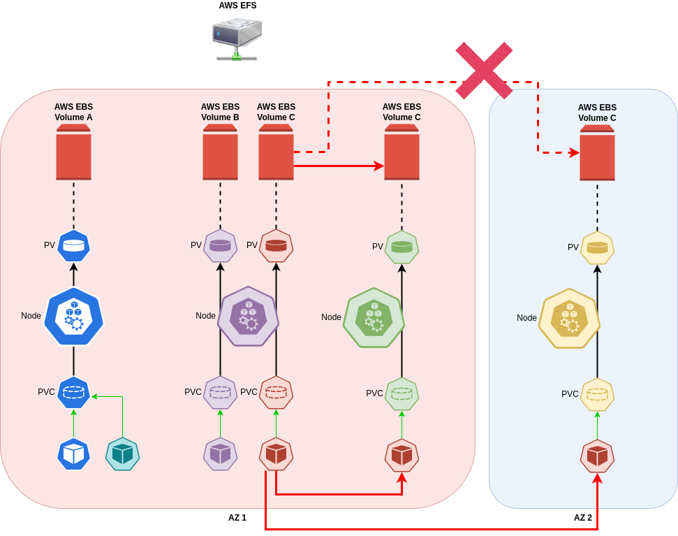

# \[EKS]  Gestion des volumes

## Définition

Les workers nodes EKS sont des instances EC2 qui peuvent utiliser des volumes de stockage sur **EBS** (Elastique Block Storage) ou sur **EFS** (Elastic File System)

* **EBS** : Stockage en mode bloque, attaché à une unique instance EC2, fonctionnant en <mark style="color:red;">mono-az</mark>
* **EFS** : Stockage en mode bloque, accessible à travers le réseau par toutes les EC2 fonctionnant sur de <mark style="color:red;">multiples-az</mark>

### EBS

1. Plusieurs PODs **fonctionnant sur le même node** peuvent accéder au même volume EBS car les écritures concurrentes sont gérées par le node
2. Les PODs sur **des nodes différents** ne peuvent pas accéder au même volume car celui-ci est attaché exclusivement au node
3. Si **tous les PODs** utilisant un volume sur un node viennent à se déplacer sur un autre node de **la même AZ**, l’accès au volume <mark style="color:blue;">**est possible**</mark> car le volume va être détaché du node source puis rattaché au node destination (situation avec le POD <mark style="color:red;">**rouge**</mark> qui arrive dans écosystème <mark style="color:green;">**vert**</mark>)
4. Si **tous les PODs** utilisant un volume sur un node viennent à se déplacer sur un autre node **dans une autre AZ**, l’accès au volume <mark style="color:blue;">**est impossible**</mark> car le volume ne peut pas être détaché du node source puis rattaché au node destination dans l'autre AZ (situation avec le POD <mark style="color:red;">**rouge**</mark> qui arrive dans écosystème <mark style="color:yellow;">**jaune**</mark>)

### EFS

1. Plusieurs PODs **fonctionnant sur le même node** peuvent accéder au même volume EFS car les écritures concurrentes sont gérées par le node
2. Les PODs sur **des nodes différents** peuvent accéder au même volume car celui-ci est presenté à tous les nodes (gestion des écritures concurrentes par le protocole NFS)
3. Si **tous les PODs** utilisant un volume sur un node viennent à se déplacer sur un autre node de **la même AZ**, l’accès au volume <mark style="color:blue;">**est possible**</mark> car le volume est accessible pour le node source et le node destination (situation avec le POD <mark style="color:red;">**rouge**</mark> qui arrive dans écosystème <mark style="color:green;">**vert**</mark>)
4. Si **tous les PODs** utilisant un volume sur un node viennent à se déplacer sur un autre node **dans une autre AZ**, l’accès au volume <mark style="color:blue;">**est possible**</mark> car le volume est accessible pour le node source et le node destination (situation avec le POD <mark style="color:red;">**rouge**</mark> qui arrive dans écosystème <mark style="color:yellow;">**jaune**</mark>)

## Sources




